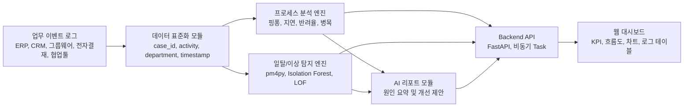

# 과제제안서

## 과제명

**FlowLens AI: AI 기반 부서 간 프로세스 결함 진단 및 최적화 웹 플랫폼**  
부제: Cross-Dept Process Pathologist

## 팀명

추후 기재

## 팀장

추후 기재

## 팀원

추후 기재

## 1. 개발과제의 개요

현대 기업의 업무는 ERP, CRM, 그룹웨어, 메신저, 전자결재 시스템 등 다양한 정보 시스템을 거치며 처리된다. 이 과정에서 남는 이벤트 로그는 실제 업무 흐름을 파악할 수 있는 객관적 근거이지만, 대부분의 조직은 로그를 단순 기록으로만 보관할 뿐 업무 프로세스 개선에 적극적으로 활용하지 못하고 있다.

특히 부서 간 협업이 필요한 업무에서는 표준 절차와 실제 수행 절차 사이의 불일치가 자주 발생한다. 대표적인 문제는 업무가 부서 사이를 반복 이동하는 **핑퐁(Ping-pong)**, 필수 검토나 승인 단계를 건너뛰는 **일탈(Process Deviance)**, 특정 부서나 담당자에게 업무가 장시간 방치되는 **지연/유휴(Idle Time)** 현상이다. 이러한 문제는 처리 시간 증가, 재작업, 책임 소재 불명확, 내부통제 리스크로 이어진다.

본 과제는 이러한 부서 간 프로세스 결함을 AI로 진단하는 웹 기반 플랫폼 **FlowLens AI**를 개발하는 것을 목표로 한다. FlowLens AI는 업무 이벤트 로그를 분석하여 부서 간 이동 경로, 반복 왕복 횟수, 평균 대기 시간, 반려 사유, 표준 절차 이탈 여부를 시각화하고, AI 기반 자연어 리포트로 병목 원인과 개선안을 제안한다.

Challenge 제출 단계에서는 핵심 가치를 빠르게 검증하기 위해 샘플 구매 요청/계약 검토 로그를 활용한 MVP를 구현한다. MVP는 부서 간 업무 흐름 시각화, KPI 자동 계산, 병목 부서 랭킹, 반려 사유 분석, AI 개선 리포트 패널을 포함한다. 이후 고도화 단계에서는 pm4py 기반 프로세스 마이닝, 통계적 이상 탐지, 온프레미스형 경량 LLM 리포팅 기능으로 확장한다.

### 개발 내용 요약

| 구분 | 내용 |
|---|---|
| 과제 목표 | 기업 업무 이벤트 로그를 기반으로 부서 간 핑퐁, 일탈, 지연/유휴 결함을 자동 진단하는 AI 웹 플랫폼 개발 |
| 핵심 사용자 | PMO/업무혁신 담당자, 부서장, 팀장, 내부통제 담당자 |
| 핵심 기능 | 업무 흐름 시각화, 3대 프로세스 결함 탐지, 병목 부서 랭킹, 반려 사유 분석, AI 개선 리포트 |
| MVP 범위 | 샘플 구매/계약 업무 로그 기반 KPI 계산, 결함 카드, 흐름도, 병목 분석, 리포트 화면 구현 |
| AI 활용 | 분석 결과를 자연어로 요약하고 반복 원인, 위험 구간, 개선 체크리스트를 제안 |
| 기대효과 | 재작업 감소, 병목 원인 파악, 부서 간 협업 개선, 내부통제 강화 |
| 활용방안 | 구매/계약 검토, 예산 승인, 품질 이슈 처리, 고객 요청 처리 등 다부서 협업 업무 분석 |

## 2. 과제의 필요성 및 기대효과

### (1) 기존 기술의 현황, 문제점 및 개선방안

국내외 기업은 업무관리 시스템, ERP, CRM, 협업툴을 통해 업무 데이터를 축적하고 있다. 또한 글로벌 시장에서는 프로세스 마이닝 솔루션을 활용해 실제 업무 흐름을 분석하고 병목을 찾는 사례가 증가하고 있다. 그러나 기존 솔루션은 고가의 라이선스 비용, 클라우드 기반 데이터 전송 부담, 국내 기업의 망분리 및 개인정보 보호 요구사항으로 인해 도입 장벽이 높다.

또한 일반적인 대시보드는 평균 처리 시간, 완료 건수, 지연 건수와 같은 결과 지표를 보여주는 데 그치는 경우가 많다. 관리자는 “어디서 지연이 발생했는지”는 볼 수 있어도, “왜 같은 구간에서 반복 반려가 발생하는지”, “표준 절차를 벗어난 경로가 어떤 리스크를 만드는지”, “어떤 개선 조치를 우선 적용해야 하는지”를 파악하기 어렵다.

### 기존 방식 대비 차별성

| 구분 | 기존 업무 대시보드 | 외산 프로세스 마이닝 솔루션 | FlowLens AI |
|---|---|---|---|
| 분석 관점 | 완료 건수, 평균 처리 시간 등 결과 지표 중심 | 실제 프로세스 흐름과 적합도 분석 중심 | 핑퐁, 일탈, 지연/유휴라는 결함 단위 진단 |
| 원인 설명 | 관리자가 직접 해석해야 함 | 전문가 중심 분석 결과 제공 | AI가 원인과 개선안을 자연어 리포트로 설명 |
| 도입 부담 | 내부 시스템별 별도 구축 필요 | 고비용, 클라우드 전송 부담 | MVP는 경량 웹, 고도화는 온프레미스 구조 지향 |
| 사용자 | 실무 관리자 및 운영 담당자 | 프로세스 분석 전문가 | PMO, 팀장, 내부통제 담당자도 이해 가능한 UI |
| 보안 대응 | 시스템별 정책에 의존 | 외부 클라우드 사용 시 제약 존재 | 비식별화와 내부망 배포를 고려한 확장 구조 |
| 실행 가능성 | 현황 파악 중심 | 분석은 강하지만 개선 실행 연결이 약할 수 있음 | 결함 탐지 결과를 체크리스트, 승인 단계 조정 등 개선안과 연결 |

본 과제는 다음 세 가지 프로세스 결함을 중심으로 기존 방식의 한계를 개선한다.

첫째, **핑퐁 결함**을 진단한다. 동일 업무가 현업팀과 구매팀, 구매팀과 재무팀, 구매팀과 법무팀 사이를 반복 이동하는 경우 왕복 횟수와 반복 사유를 분석하여 재작업 원인을 찾는다.

둘째, **일탈 결함**을 진단한다. 표준 프로세스상 필요한 검토 또는 승인 단계를 건너뛰거나 비정상 경로로 업무가 이동한 경우 이를 탐지하여 내부통제 및 컴플라이언스 리스크를 파악한다.

셋째, **지연/유휴 결함**을 진단한다. 단순 리드타임뿐 아니라 특정 부서의 평균 대기 시간, 장기 미처리 구간, 담당자 변경 빈도 등을 분석하여 실제 병목이 발생하는 지점을 찾는다.

FlowLens AI는 초기 MVP에서는 샘플 로그 기반 규칙/통계 분석으로 기능을 검증하고, 고도화 단계에서는 pm4py의 프로세스 마이닝 기법, Isolation Forest/LOF 기반 이상 탐지, 경량 LLM 기반 자연어 요약을 결합하여 확장 가능한 온프레미스 분석 플랫폼으로 발전시킨다.

### (2) 과제개발 혹은 제작에 따른 기대효과

본 과제를 통해 기대되는 효과는 다음과 같다.

- 보이지 않던 부서 간 반복 이동과 병목 구간을 데이터 기반으로 시각화한다.
- 업무 반려, 재요청, 승인 지연의 주요 원인을 자동 분류하여 관리자의 분석 시간을 줄인다.
- 특정 부서나 개인을 비난하는 방식이 아니라, 프로세스 설계의 결함을 객관적으로 개선하는 문화를 만든다.
- 필수 입력값 체크리스트, 사전 검토 자동화, 승인 단계 조정 등 실행 가능한 개선안을 도출한다.
- 망분리와 개인정보 보호 요구가 강한 기업 환경에서도 적용 가능한 온프레미스 확장 방향을 제시한다.
- 장기적으로 업무 처리 리드타임 단축, 재작업 감소, 내부통제 강화, 협업 비용 절감에 기여할 수 있다.

## 3. 과제목표 및 내용

### 최종목표

본 과제의 최종 목표는 기업 업무 이벤트 로그를 분석하여 핑퐁, 일탈, 지연/유휴의 3대 프로세스 결함을 자동 탐지하고, 관리자가 이해할 수 있는 자연어 개선 리포트를 제공하는 웹 플랫폼을 개발하는 것이다.

초기 MVP 목표는 다음과 같다.

- 구매 요청/계약 검토 업무를 중심으로 샘플 이벤트 로그 데이터셋 구축
- 부서 간 이동 횟수, 평균 대기 시간, 반려율, 병목 부서 자동 산출
- 핑퐁 구간과 주요 반려 사유를 대시보드로 시각화
- AI 리포트 형태의 병목 원인 요약 및 개선 제안 제공
- 실제 배포 가능한 웹 프로토타입 구현

최종 고도화 목표는 다음과 같다.

- 공개 이벤트 로그 및 확장 샘플 데이터 기반 프로세스 마이닝 엔진 적용
- 표준 프로세스와 실제 로그 간 적합도 및 일탈 경로 분석
- 이상 탐지 알고리즘을 활용한 비정상 핑퐁 및 장기 유휴 탐지
- 온프레미스 환경을 고려한 경량 LLM 또는 API 기반 자연어 리포팅 모듈 설계
- 대용량 로그 처리를 고려한 백엔드 분석 파이프라인과 배포 구조 설계

### 성능 및 품질 검증 방법

본 과제는 기능 구현뿐 아니라 탐지 결과의 타당성과 사용자 이해도를 함께 검증한다. MVP 단계에서는 사람이 정의한 샘플 정답 기준과 대시보드 산출 결과를 비교하고, 고도화 단계에서는 BPI Challenge 등 공개 이벤트 로그를 활용하여 분석 엔진의 성능을 검증한다.

| 평가 항목 | 검증 방법 | 주요 지표 |
|---|---|---|
| 핑퐁 탐지 | 동일 부서 쌍 간 반복 왕복이 발생한 케이스를 사람이 라벨링한 결과와 비교 | 반복 구간 탐지 정확도, 왕복 횟수 일치 여부 |
| 일탈 탐지 | 표준 프로세스 경로와 실제 로그 경로를 비교하여 누락 단계와 우회 경로 확인 | 필수 단계 누락 탐지 여부, 일탈 경로 식별률 |
| 지연/유휴 탐지 | 부서별 평균 대기 시간과 이상치 탐지 결과를 비교 | 평균 대기 시간 산출 정확도, 장기 대기 케이스 탐지 여부 |
| AI 리포트 | 사용자 평가를 통해 원인 설명과 개선안의 적절성 확인 | 설명 이해도, 개선안 실행 가능성, 리포트 만족도 |
| 웹 사용성 | PMO/팀장 관점의 시나리오 기반 사용성 점검 | 핵심 지표 파악 시간, 화면 이해도, 기능 완성도 |

### 주요 개발 내용

#### 1) 업무 이벤트 로그 데이터 모델

업무 ID, 업무명, 이전 부서, 이동 부서, 액션, 반려/지연 사유, 발생 시각, 담당자, 상태를 포함한 표준 로그 스키마를 설계한다. 이를 통해 ERP, 그룹웨어, 전자결재, 협업툴 등 다양한 원천 시스템의 로그를 공통 분석 형식으로 변환할 수 있도록 한다.

#### 2) 핑퐁 및 병목 분석 엔진

부서 간 이동 횟수, 동일 구간 왕복 횟수, 평균 대기 시간, 지연 건수, 반려율을 계산한다. MVP에서는 규칙 기반 분석과 통계 집계를 사용하고, 고도화 단계에서는 Isolation Forest, Local Outlier Factor 등 이상 탐지 기법을 활용하여 통계적으로 비정상적인 반복 이동과 유휴 상태를 탐지한다.

#### 3) 프로세스 일탈 탐지 엔진

표준 업무 절차와 실제 로그를 비교하여 필수 검토 단계 누락, 비정상 승인 경로, 우회 처리 등을 탐지한다. 고도화 단계에서는 pm4py 기반 Inductive Miner, Token-based Replay 등 프로세스 마이닝 기법을 적용하여 실제 프로세스 모델과 적합도(Fitness)를 분석한다.

#### 4) AI 기반 자연어 리포트

분석 엔진이 도출한 병목 구간, 반복 반려 사유, 일탈 경로를 기반으로 관리자가 이해하기 쉬운 자연어 리포트를 생성한다. MVP에서는 분석 결과 기반 템플릿 리포트를 제공하고, 고도화 단계에서는 Gemini API 또는 온프레미스 경량 LLM을 활용해 원인 요약과 개선안을 자동 생성한다.

AI 리포트 모듈은 다음 역할을 수행한다.

- 로그 패턴 분석 결과를 관리자용 자연어 문장으로 요약
- 반복 반려 사유를 유사 원인끼리 묶어 주요 원인 후보 제시
- 병목 구간과 일탈 경로가 만드는 업무 리스크 설명
- 필수 입력값 체크리스트, 사전 검토 자동화, 승인 단계 조정 등 개선 조치 제안
- 월간/주간 프로세스 개선 보고서 초안 자동 생성

#### 5) 웹 대시보드

관리자가 전체 업무 흐름을 한눈에 볼 수 있도록 KPI 카드, 부서 간 흐름도, 병목 부서 랭킹, 반려 사유 차트, AI 리포트, 업무 로그 테이블을 제공한다. 향후 React, D3.js, React Flow 등을 활용하여 복잡한 프로세스 맵을 인터랙티브하게 탐색할 수 있도록 확장한다.

### 비기능 요구사항

- 보안: 개인정보 및 민감 업무 정보 비식별화, 역할 기반 접근 제어 고려
- 확장성: 다양한 업무 시스템 로그와 연동 가능한 데이터 스키마 설계
- 성능: 대용량 로그 분석을 고려한 비동기 처리 및 캐싱 구조 설계
- 사용성: 비전문 관리자도 이해할 수 있는 시각화 중심 UI 제공
- 유지보수성: 데이터 처리, 분석 엔진, AI 리포트, 프론트엔드 모듈 분리
- 배포성: 클라우드 배포와 온프레미스 Docker 패키징을 모두 고려

## 4. 추진전략 및 방법

### (1) 추진전략 및 방법

본 프로젝트는 **MVP 검증 후 단계적 고도화** 전략을 따른다. 초기에는 샘플 로그를 기반으로 핵심 문제와 사용자 경험을 검증하고, 이후 공개 이벤트 로그 및 실제 기업 환경을 고려한 분석 엔진으로 확장한다.

1단계에서는 구매 요청/계약 검토 시나리오를 중심으로 문제를 구체화한다. 현업팀, 구매팀, 재무팀, 법무팀, 임원 승인 단계로 구성된 샘플 업무 흐름을 정의하고, 핑퐁, 일탈, 지연이 발생하는 대표 사례를 설계한다.

2단계에서는 이벤트 로그 데이터 모델을 설계한다. 각 업무 이벤트를 case_id, activity, department, timestamp, action, reason, status 등으로 구조화하여 향후 XES 형식이나 프로세스 마이닝 도구와 연계할 수 있도록 한다.

3단계에서는 분석 알고리즘을 구현한다. MVP에서는 JavaScript 기반 통계 집계로 KPI와 병목을 산출하고, 고도화 단계에서는 Python 기반 pm4py, Pandas/Polars, Scikit-learn을 활용해 대규모 로그 분석과 이상 탐지를 수행한다.

4단계에서는 AI 리포트 기능을 구현한다. 초기에는 분석 결과를 기반으로 규칙형 자연어 리포트를 생성하고, 이후 Gemini API 또는 4-bit 양자화 sLLM을 활용한 온프레미스 리포팅 구조를 검토한다. 이때 민감한 로그가 외부로 유출되지 않도록 비식별화 및 내부망 배포 전략을 함께 고려한다.

5단계에서는 웹 대시보드를 구현하고 사용자 피드백을 반영한다. 관리자가 문제 지점을 빠르게 찾을 수 있도록 흐름도와 KPI 중심으로 화면을 구성하고, 상세 로그와 AI 제안을 함께 제공한다.

### 사용자 활용 시나리오

PMO 담당자는 월간 구매 요청 및 계약 검토 로그를 FlowLens AI에 업로드한다. 시스템은 현업팀과 구매팀 사이의 반복 반려, 재무팀의 장기 대기, 법무 검토가 생략된 승인 요청을 자동 탐지한다. 담당자는 대시보드에서 “현업팀 ↔ 구매팀 구간의 핑퐁 반복”과 “예산 코드 누락”이 주요 원인임을 확인하고, AI 리포트를 통해 구매 요청 등록 단계에 예산 코드와 계약 유형을 필수 입력값으로 추가하는 개선안을 도출한다. 이후 다음 달 로그를 다시 분석하여 핑퐁 횟수와 평균 대기 시간이 감소했는지 비교함으로써 개선 효과를 확인한다.

팀장은 자신의 부서가 병목으로 표시된 경우, 단순히 담당자를 추궁하는 것이 아니라 어떤 유형의 업무가 어떤 사유로 대기되는지 확인한다. 예를 들어 재무팀의 평균 대기 시간이 높게 나타난다면 예산 검토 요청이 특정 시간대에 몰리는지, 필수 첨부 자료가 누락되는지, 승인 권한자가 부족한지 등을 AI 리포트와 상세 로그를 통해 파악할 수 있다.

### 리스크 및 대응 방안

| 리스크 | 영향 | 대응 방안 |
|---|---|---|
| 실제 기업 로그 확보 어려움 | 초기 검증 데이터 부족 | 샘플 데이터와 BPI Challenge 공개 로그를 활용해 1차 검증 |
| 민감 정보 및 개인정보 포함 가능성 | 보안/컴플라이언스 이슈 | 분석 전 비식별화, 민감 필드 제거, 온프레미스 배포 구조 설계 |
| LLM API 사용 시 데이터 외부 전송 우려 | 기업 도입 제약 | MVP는 템플릿 리포트로 구현하고, 고도화 단계에서 Gemini API와 온프레미스 sLLM을 선택 가능하게 설계 |
| 대용량 로그 처리 성능 저하 | 분석 지연 및 사용자 경험 저하 | Pandas/Polars, 비동기 Task, 캐싱, 배치 분석 구조 적용 |
| 이상 탐지 결과 해석 어려움 | 사용자가 결과를 신뢰하지 못할 수 있음 | 탐지 근거 로그, 계산 지표, 자연어 설명을 함께 제공 |
| 과도한 책임 추궁 도구로 오해될 가능성 | 조직 수용성 저하 | 개인 평가가 아닌 프로세스 개선 도구임을 명확히 하고 부서/구간 단위 분석 중심으로 설계 |

### (2) 추진체계

- 팀장: 프로젝트 총괄, 요구사항 정의, 기획서 작성, 발표자료 제작, 프론트엔드 대시보드 구현
- 팀원: 데이터 모델 설계, 분석 로직 구현, 백엔드/API 설계, AI 리포트 및 고도화 기술 조사

### 시스템 아키텍처

### MVP 구현 범위

현재 제출용 MVP는 정적 웹 기반 프로토타입으로 구현한다. 샘플 업무 로그를 브라우저에서 직접 분석하여 평균 대기 시간, 핑퐁 구간, 병목 부서, 반려율을 계산하고, 분석 결과를 대시보드와 AI 리포트 형태로 제공한다. 이는 최종 플랫폼의 핵심 사용자 경험과 분석 가치를 검증하기 위한 1차 산출물이다.

## 5. 추진일정

| 구분 | 단위 업무 | 상세 개발 내용 | 1 | 2 | 3 | 4 | 5 | 6 | 7 | 8 | 9 | 10 | 11 | 12 | 13 | 14 | 15 | 비고 |
|---|---|---|---|---|---|---|---|---|---|---|---|---|---|---|---|---|---|---|
| 기획 | 요구사항 분석 | 핑퐁/일탈/지연 시나리오 정의 및 사용자 요구사항 정리 | ■ | ■ |  |  |  |  |  |  |  |  |  |  |  |  |  | MVP 범위 확정 |
| 조사 | 기술 및 사례 조사 | 프로세스 마이닝, 업무관리 솔루션, AI 리포팅 사례 조사 | ■ | ■ | ■ |  |  |  |  |  |  |  |  |  |  |  |  | 참고문헌 정리 |
| 데이터 | 로그 스키마 설계 | 표준 이벤트 로그 스키마 및 샘플 데이터셋 구축 |  | ■ | ■ | ■ |  |  |  |  |  |  |  |  |  |  |  | XES 연계 고려 |
| 엔진 | 기본 분석 구현 | 핑퐁 횟수, 평균 대기 시간, 반려율, 병목 부서 산출 |  |  | ■ | ■ | ■ |  |  |  |  |  |  |  |  |  |  | MVP 분석 엔진 |
| 엔진 | 일탈 탐지 설계 | 표준 프로세스와 실제 로그 비교 로직 설계 |  |  |  | ■ | ■ | ■ |  |  |  |  |  |  |  |  |  | pm4py 적용 검토 |
| 엔진 | 이상 탐지 고도화 | Isolation Forest/LOF 기반 핑퐁 및 유휴 탐지 |  |  |  |  | ■ | ■ | ■ | ■ |  |  |  |  |  |  |  | 통계 모델 적용 |
| 웹 | 프론트엔드 개발 | KPI, 흐름도, 차트, 로그 테이블, AI 리포트 화면 구현 |  |  |  |  | ■ | ■ | ■ | ■ | ■ |  |  |  |  |  |  | 대시보드 구현 |
| 웹 | 백엔드/API 개발 | FastAPI 기반 로그 조회, 분석 요청, 리포트 API 설계 |  |  |  |  |  | ■ | ■ | ■ | ■ |  |  |  |  |  |  | 비동기 처리 고려 |
| AI | 리포트 생성 | 템플릿 리포트, Gemini API 또는 경량 LLM 연계 구조 구현 |  |  |  |  |  |  | ■ | ■ | ■ | ■ | ■ |  |  |  |  | AI 요약 기능 |
| 통합 | 시스템 통합 | 프론트엔드, 분석 엔진, API, 리포트 모듈 통합 |  |  |  |  |  |  |  |  | ■ | ■ | ■ |  |  |  |  | 통합 테스트 |
| 검증 | 성능 및 품질 검증 | 공개 로그/샘플 로그 기반 분석 정확성 및 응답 속도 검증 |  |  |  |  |  |  |  |  |  | ■ | ■ | ■ |  |  |  | BPI 로그 활용 |
| 보안 | 보안 및 비식별화 | 민감 정보 비식별화, 접근 제어, 온프레미스 배포 검토 |  |  |  |  |  |  |  |  |  |  | ■ | ■ | ■ |  |  | 내부망 고려 |
| 마무리 | 패키징 및 발표 | Docker 패키징, 최종 문서화, 발표자료 및 시연 준비 |  |  |  |  |  |  |  |  |  |  |  |  | ■ | ■ | ■ | 최종 제출 |

## 6. 참고문헌

1. van der Aalst, W. M. P. (2016). *Process Mining: Data Science in Action*. Springer.
2. Dumas, M., La Rosa, M., Mendling, J., & Reijers, H. A. (2018). *Fundamentals of Business Process Management*. Springer.
3. van der Aalst, W. M. P. et al. (2011). Process Mining Manifesto. *Business Process Management Workshops*.
4. Berti, A., van Zelst, S. J., & Schuster, D. (2019). Process Mining for Python (PM4Py). *ICPME*.
5. Rozinat, A., & van der Aalst, W. M. P. (2008). Conformance checking based on monitoring real behavior. *Information Systems*.
6. Leemans, S. J. J., Fahland, D., & van der Aalst, W. M. P. (2013). Discovering Block-Structured Process Models from Event Logs. *Petri Nets*.
7. Chandola, V., Banerjee, A., & Kumar, V. (2009). Anomaly Detection: A Survey. *ACM Computing Surveys*.
8. Liu, F. T., Ting, K. M., & Zhou, Z. H. (2008). Isolation Forest. *ICDM*.
9. Breunig, M. M., Kriegel, H. P., Ng, R. T., & Sander, J. (2000). LOF: Identifying Density-Based Local Outliers. *SIGMOD*.
10. Pedregosa, F. et al. (2011). Scikit-learn: Machine Learning in Python. *JMLR*.
11. Suriadi, S. et al. (2013). Root Cause Analysis with Decision Trees in Process Mining. *BPM*.
12. Reinkemeyer, L. (2020). *Process Mining in Action*. Springer.
13. IEEE Std 1849-2016. IEEE Standard for eXtensible Event Stream (XES).
14. Bostock, M., Ogievetsky, V., & Heer, J. (2011). D3: Data-Driven Documents. *IEEE TVCG*.
15. Ramirez, S. (2020). FastAPI Documentation and related materials.
16. Gerganov, G. (2023). llama.cpp: LLM inference in C/C++.
17. Abdin, M. et al. (2024). Phi-3 Technical Report. Microsoft Research.
18. Lewis, P. et al. (2020). Retrieval-Augmented Generation for Knowledge-Intensive NLP Tasks. *NeurIPS*.
19. 4TU.ResearchData. BPI Challenge Event Logs.
20. Wirth, R., & Hipp, J. (2000). CRISP-DM: Towards a standard process model for data mining.
